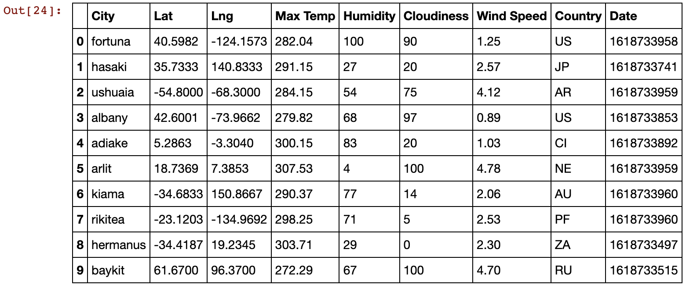
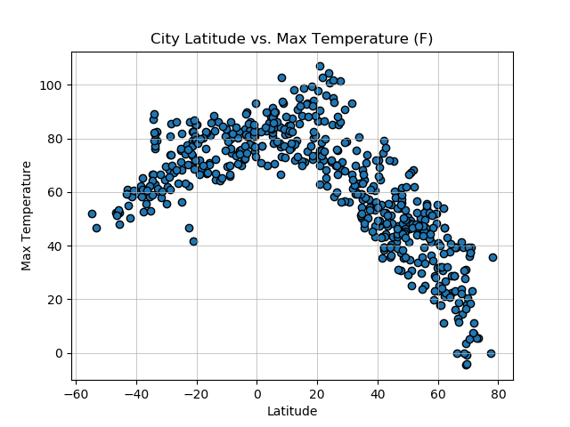
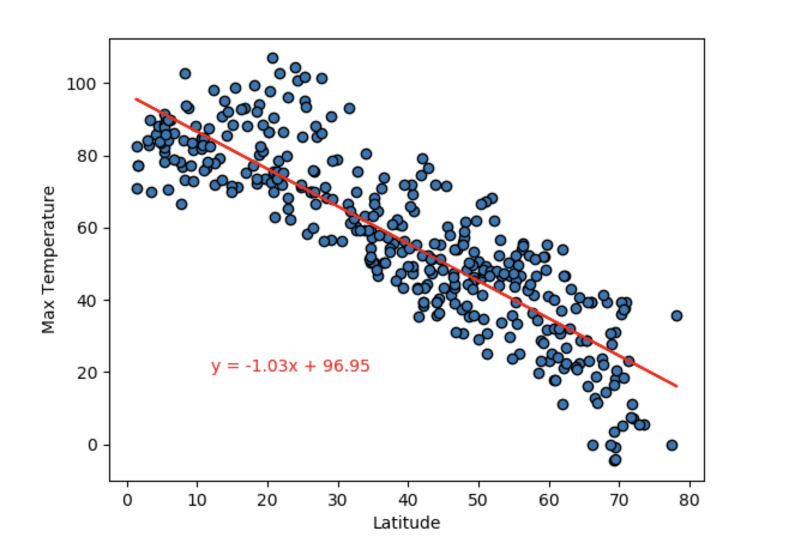
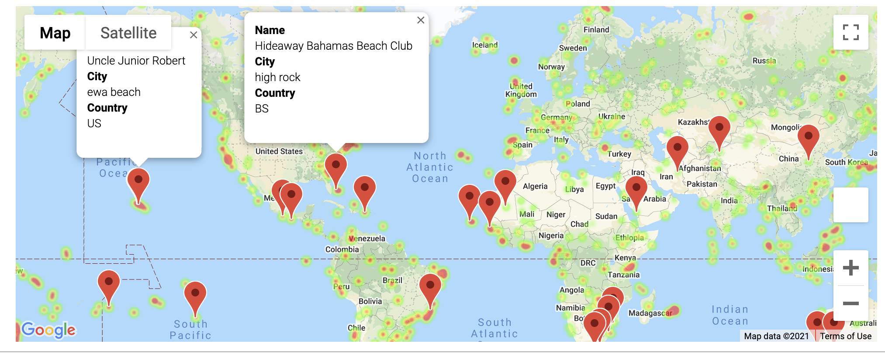

## Summary

Although it may be obvious, how exactly does the weather change as we move closer to the equator? With the use of thee [OpenWeatherMap API](https://openweathermap.org/api), we can use the weather data from 500+ cities around the world for analysis. 

## Scope

I used Jupyter Notebook and Pandas in order to load in data from the OpenWeatherMap API and created a Pandas DataFrame with that information.

The next step was to create a series of scatter plots to showcase the following relationships:

 - Temperature (F) vs. Latitude
 - Humidity (%) vs. Latitude
 - Cloudiness (%) vs. Latitude
 - Wind Speed (mph) vs. Latitude

Then I ran linear regression on each relationship. I separated the plots into Northern Hemisphere (greater than or equal to 0 degrees latitude) and Southern Hemisphere (less than 0 degrees latitude):

 - Northern Hemisphere - Temperature (F) vs. Latitude
 - Southern Hemisphere - Temperature (F) vs. Latitude
 - Northern Hemisphere - Humidity (%) vs. Latitude
 - Southern Hemisphere - Humidity (%) vs. Latitude
 - Northern Hemisphere - Cloudiness (%) vs. Latitude
 - Southern Hemisphere - Cloudiness (%) vs. Latitude
 - Northern Hemisphere - Wind Speed (mph) vs. Latitude
 - Southern Hemisphere - Wind Speed (mph) vs. Latitude

After each pair of plots, an explanation of what the linear regression is modeling is noted within the Jupyter Notebook.

Given the results from original analysis, I took it a step further to display on a map hotels with their city and country information given my prefered weather conditions.

